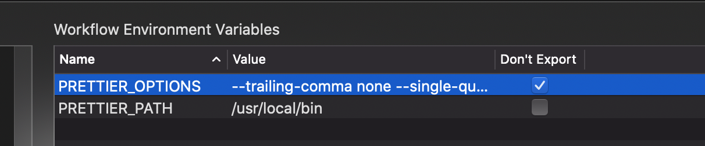
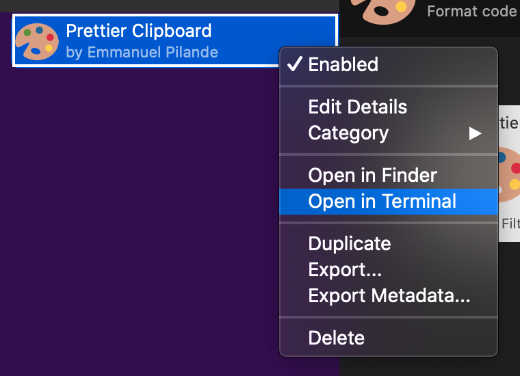

  <h1>Alfred Prettier Clipboard 🎨</h1>

  <strong>Format code in your clipboard with Prettier</strong> 
  

## Why?

Sometimes you're writing code in a textarea where you don't have plugins/extension to automatically format your code.
Rather than manually formatting, you can run prettier on it with this workflow.

## Requirements

- [`node`](https://nodejs.org/) - Node.js JavaScript runtime.
- [`prettier`](https://prettier.io/) - Opinionated Code Formatter.

## Installation

1. Install dependencies [`node`](https://nodejs.org/) and [`prettier`](https://prettier.io/) (must be installed globally).
1. Download the Alfred Workflow ([Prettier-Clipboard.alfredworkflow](https://github.com/epilande/alfred-prettier-clipboard/releases/latest/download/Prettier-Clipboard.alfredworkflow)).
1. Double-click to import into Alfred (requires Powerpack).
1. Customize prettier with workflow variable `PRETTIER_OPTIONS` or `.prettierrc` (see [configuration](#configuration)).

## Usage

`prettier {parser}` - Run prettier on your clipboard with selected `{parser}`.

## Environment variables

| Key                | Default            | Description                                 |
| ------------------ | ------------------ | ------------------------------------------- |
| `PRETTIER_OPTIONS` |                    | Options to be passed to `prettier` command. |
| `PRETTIER_PATH`    | `"/usr/local/bin"` | Where to find `prettier`.                   |

## Configuration

To customize prettier, we can either pass options with environment variables `PRETTIER_OPTIONS` or create a configuration file i.e. `.prettierrc`.

#### `PRETTIER_OPTIONS`

With `PRETTIER_OPTIONS` we can use the CLI overrides from https://prettier.io/docs/en/options.html.

#### Configuration file

Prettier will automatically pick up configuration files, so we can customize prettier by adding a `.prettierrc` file in the workflow directory or globally at `~/.prettierc`.

To add `.prettierrc` in the workflow directory

1. Go to Alfred workflows, find Prettier Clipboard. You can also do this by typing `?prettier` in Alfred.
1. Right-click -> Open in terminal.  
   
1. Create `.prettierrc` for example: `$ echo '{ "semi": false, "trailingComma": "all" }' > .prettierrc`
   (see https://prettier.io/docs/en/options.html for available options).

## License

[MIT License](https://oss.ninja/mit/epilande/)
